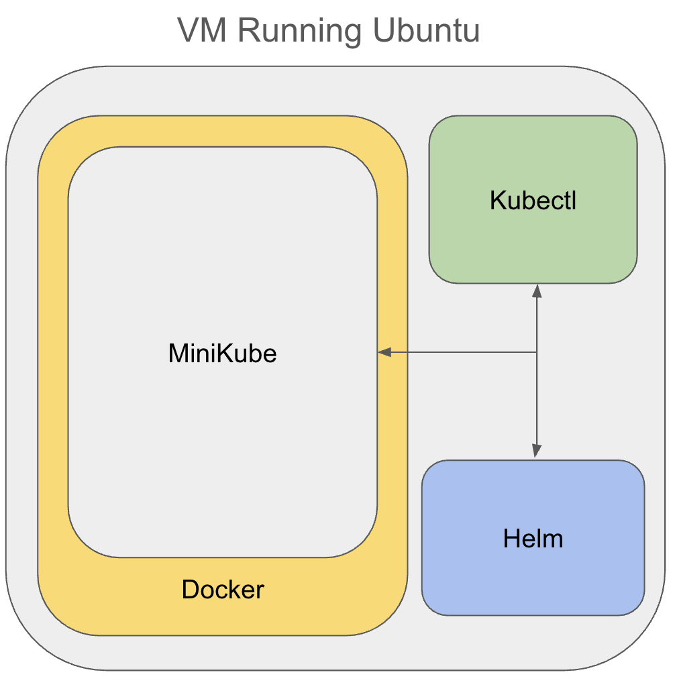
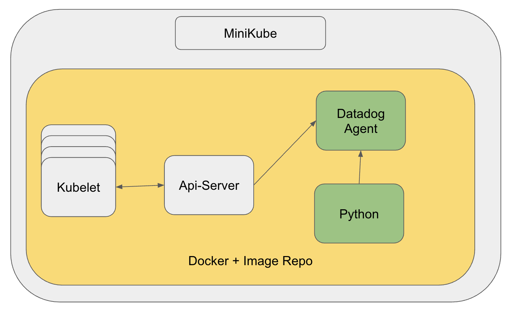
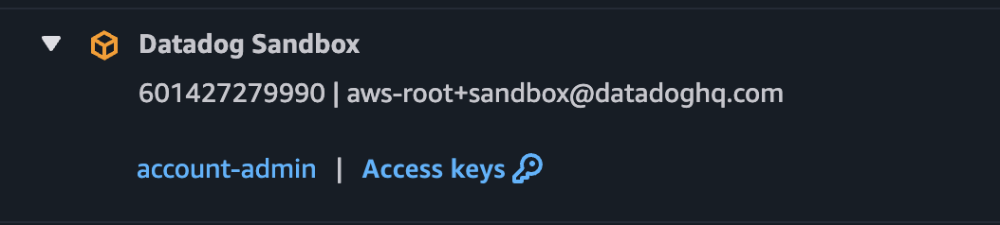
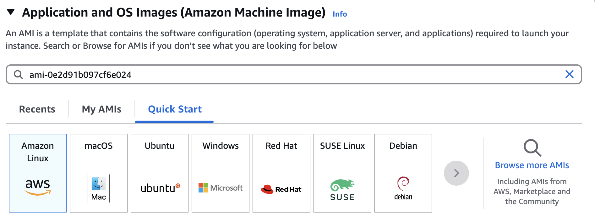

# Datadog Training

Welcome to Datadog training 101.

## Test Setup:

Here we have a single VM running Docker that has a single container that runs Minkube. The services (Helm, Kubectl) have already been installed and configured to talk to Minkube already.

**If you restart Minikube you will lose any changes you make**

##How does Minikube work?
Minikube itself is a Docker Image that itself contains a Docker instance and image repository to give you a single node cluster with direct access to all the features of Kubernetes for you to deploy workloads against.

**As a result to run workloads you need to copy your files to the minikube instance first before you run them (minikube cp)**

The Datadog agent in this example will be configured to talk directly to the Kubernetes API-Server to discover namespace, schedules etc. 

Python applications use a dd-trace wrapper to report APM spans/trace IDs.

## Setup your VM
I have created an AMI image with Minikube/Helm/Docker all installed for you. You simply need to login to our shared internal AWS account and build a fresh VM with it:

### Accessing AWS

- login to [Google Dashboard]](https://workspace.google.com/dashboard) and click on AWS SSO

- Select **Datadog Sandbox**, account-admin

  

### Creating the VM

- Click on **EC2**,
- Top Right of the screen make sure you are in the **Europe (London)** Region

- Click **Launch instance**

- Create a VM With the following parameters:
  - Name:		*Give is a name you will remember*
  - Use the AMI: 	ami-0e2d91b097cf6e024
  - Instance Type:	t2.xlarge
  - Key pair:		*create a new one*
  - VPC:			vpc-33549c5a
  - Security Group:	launch-wizard-20

Note: Finding the AMI can be tricky you have to search for it rather then click the ones listed:

### Accessing your new VM

Click back into EC2 and wait until your VM is in the state **Running**

Copy the Public IPv4 address and open up a terminal.

you can now access your VM like so:

`ssh ubuntu@[public IPv4] -i [ssh pem file you created earlier]`

### Cloning Git Repository

Once you are on the VM make sure you are in the /home/ubuntu directory.

`git clone git@github.com:crofty13/Datadog.git`

All the files you will need are in **Datadog/spark-exercise.** Enjoy!

